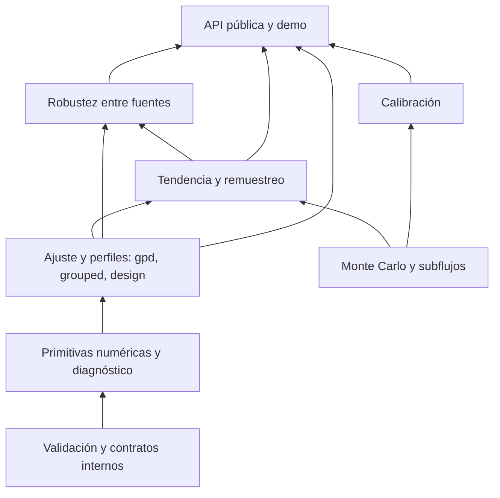

# Revisión de software y plan de mejora de nsevt

Fecha: 2026-09-06. Versión del código: 1.0.3.
Commit revisado: `959cf5d22f626413177f15926031bd8386e19d4c`.
Estado del plan: propuesto para implementación posterior; ninguna corrección implementada en esta revisión.

## 1. Dictamen

La estructura de nsevt es adecuada para una biblioteca científica pequeña:
paquete `src/`, módulos por responsabilidad, dependencias de ejecución limitadas
a NumPy y SciPy, API documentada y proceso de publicación con controles de
integridad. Conviene conservar esa estructura.

Sin embargo, **no es correcto considerar que todos los resultados están
protegidos frente a casos límite**. Se reprodujeron errores de selección de datos
agrupados, intervalos, remuestreo y tratamiento de resultados inválidos. Algunos
devuelven números plausibles sin lanzar una excepción. La prioridad es consolidar
la corrección estadística y numérica antes de ampliar funcionalidades.

Pasar pruebas y tener una API estable no equivale a demostrar cobertura o
calibración estadística en todos los regímenes. El propio `docs/validation.md`
reconoce esa diferencia; esta revisión identifica casos que deben añadirse a
esas garantías.

## 2. Alcance y evidencia

Se inspeccionaron todos los módulos Python de `src/nsevt`, la suite de pruebas,
la demo, los scripts de release, `pyproject.toml`, los cuatro workflows, la
documentación técnica, el manuscrito y los documentos locales de planificación.
El árbol de trabajo estaba limpio al comenzar. No se modificó código de
producción, pruebas, configuración ni versiones.

Las comprobaciones dinámicas usaron Python 3.14.6, NumPy 2.5.2 y SciPy 1.18.1.
Los ejemplos de esta revisión son contraejemplos y comprobaciones puntuales;
no constituyen una campaña exhaustiva de calibración.

Validación de ingeniería realizada:

- `python tools/release_check.py`: PASS.
- Construcción de wheel y sdist desde una copia temporal de `git archive HEAD`: PASS.
- `write_checksums.py` y `check_distributions.py` sobre esos artefactos: PASS.
- Pruebas, lint y tipado: resultados finales en la sección 8.

No se verificaron la configuración efectiva de permisos de GitHub/PyPI/Zenodo,
las protecciones de ramas, el estado actual de servicios remotos, otras
versiones de Python ni Windows/macOS. Se revisaron sus declaraciones locales.
La demo se revisó por código; no se hizo una sesión interactiva de Streamlit.

## 3. Arquitectura actual y dirección recomendada

| Área | Evaluación | Dirección |
| --- | --- | --- |
| `gpd`, `grouped`, `design` | Separación funcional comprensible; validación y kernels numéricos desiguales | Compartir primitivas privadas de validación, probabilidades y diagnóstico |
| `trend` | Integra ajuste, permutación, potencia, MDE y bootstrap | Separar internamente estimación, remuestreo y resumen; conservar entrada pública |
| `mc`, `calibration` | Buena base de precisión y subflujos reproducibles | Contratos explícitos para resultados inválidos y réplicas efectivas |
| `transportability` | Buena distinción entre dirección, reproducción y falta de potencia | Conservar MCSE, fallos y soporte temporal al producir el veredicto |
| API pública | Funciones simples y dataclasses; bastantes retornos `dict` sin esquema tipado | Añadir `TypedDict`, tipos concretos y pruebas de contratos compatibles |
| Experimental | Namespace explícito, pero documentos contradictorios | Una única lista de símbolos y garantías |
| Demo | Útil como ejemplo, costosa ante cada interacción | Validación de entrada, ejecución explícita y caché de cálculos |
| Release | Hashes, OIDC, acciones fijadas y pruebas de artefactos | Mantener; ampliar comprobaciones de compatibilidad y procedencia |

Dependencia interna objetivo:



Esta reorganización puede hacerse con módulos privados como `_validation.py`,
`_numerics.py` y `_results.py`, introducidos cuando una corrección los necesite.
No hace falta una reescritura general ni infraestructura de servicios para el
alcance actual. Mantener NumPy/SciPy como dependencias del núcleo.

## 4. Hallazgos priorizados

**P0**: puede invalidar o representar incorrectamente un resultado; corregir
antes de presentar como fiable el caso afectado. **P1**: robustez, coherencia o
validación necesaria. **P2**: mantenibilidad, experiencia de uso y evolución.
La prioridad expresa impacto en esta biblioteca, no una vulnerabilidad de seguridad.

### H01 — P0 — Un optimizador puede devolver una penalización como ajuste válido

**Evidencia:** `grouped.py:79`, `grouped.py:116`, `grouped.py:131`;
patrón similar en `design.py:144`, `gpd.py:75` y `trend.py:72`.
Las funciones objetivo devuelven penalizaciones finitas (`1e10`/`1e100`), pero
el criterio de aceptación comprueba `success` y finitud. Un simplex puede
converger sobre una región inválida de penalización constante.

Reproducción: `fit_gpd_grouped([45, 50, 55], 40, grid=np.nan)` devuelve
`xi=-0.4`, `sigma≈10`, `loglik=-10000000000`, sin rechazar la entrada.
También ocurre con celdas cuyo límite superior es menor que el inferior.
La reproducción directa corresponde a `grouped`; el patrón compartido amerita
comprobar los otros optimizadores, sin asumir que todos fallen en el mismo caso.

**Corrección:** validar finitud, dimensiones, alineación y dominio antes del
ajuste; verificar soporte y valor objetivo real al aceptar el resultado.
No basta con sustituir una constante por otra. Separar convergencia algorítmica
de factibilidad del modelo y rechazar una solución exclusivamente penalizada.

**Aceptación:** entradas inválidas fallan con `ValueError`; fallos del ajuste
producen `RuntimeError` o un diagnóstico explícito; ningún ajuste aceptado tiene
probabilidades inválidas o valor objetivo de penalización.

### H02 — P0 — La truncación agrupada supone que el umbral coincide con la rejilla

**Evidencia:** `grouped.py:39`, especialmente `trunc = half` en la línea 75.
Para umbral 42, rejilla 5 y primera marca 45, la celda es `[0.5, 5.5)` en
escala de exceso. La entrada por marca registrada permite excesos desde 0.5,
pero se condiciona sobre 2.5. Bajo una exponencial de escala 1, la supuesta
probabilidad condicional de esa celda resulta **7.339269**, mayor que uno.

**Corrección:** derivar el punto de selección a partir del umbral, el origen
de rejilla y la primera marca admisible, o restringir explícitamente los
umbrales soportados. Si la truncación corta una celda, integrar únicamente su
parte observable. Validar también `cells` suministradas por el usuario.

La precisión mixta inferida por divisibilidad es otra hipótesis: un valor
múltiplo de 5 también puede provenir de un instrumento con precisión 1. Añadir
posteriormente precisión por observación o celdas explícitas verificadas;
no presentar la heurística actual como identificación del proceso de medición.

**Aceptación:** probabilidades en `[0,1]`, normalización sobre las celdas
observables, casos analíticos con umbrales alineados y desplazados y simulación
con precisión conocida.

### H03 — P0 — Perfiles agrupados inconsistentes y pérdida de límites abiertos

**Evidencia:** `grouped.py:141`, `grouped.py:214`, `grouped.py:300`.
El ajuste de forma no comparte dominio con sus perfiles: el CI usa por defecto
`[-0.95, 0.60]`, mientras el ajuste puede quedar fuera. Con `[45,50,55]` y
umbral 40 se obtuvo `xi≈-1.000000015` y CI `[-0.95,0.60]`: no contiene el ajuste.
No se debe trasladar automáticamente al modelo agrupado la restricción de
existencia del MLE continuo; hay que definir y validar el dominio apropiado.

El perfil del extremo vuelve a optimizar restringiendo `xi` a valores negativos
y usa `gap_max=400`. El wrapper pierde `upper_at_bound`, `lo_at_bound` y
`hi_at_bound`. En una muestra de cola pesada se obtuvo `xi=0.4098`,
`endpoint=inf` y `endpoint_ci95≈[499.20,617.50]`; el límite superior era una
frontera de búsqueda que el resumen no revelaba. Se generaron 300 observaciones
con `xi=0.25`, escala 8, umbral 40, uniformes de `default_rng(13)`, transformación
inversa GPD y redondeo a múltiplos de 5; quedaron 234 excedencias registradas.

Además, `gpd_pot_grouped(level=0.80)` devuelve campos y textos llamados
`ci95`, y `bounded_supported` sigue describiéndose como evidencia al 95%.

**Corrección:** definir un dominio coherente entre ajuste y perfiles, ampliar
la búsqueda adaptativamente, distinguir un límite numérico de un límite
estadístico e incluir los diagnósticos en el resultado final. Tratar de forma
explícita los extremos infinitos y los perfiles restringidos a colas acotadas.
Conservar el nivel realmente solicitado en el resultado y su presentación.

**Aceptación:** CI contiene el óptimo del modelo que dice perfilar, inversión
LR comprobada en los extremos interiores, fronteras expuestas al usuario,
pruebas con `xi>0`, cerca de cero, muestras pequeñas y `level!=0.95`.

### H04 — P0 — El bootstrap de tendencia destruye la asociación con el tiempo

**Evidencia:** `trend.py:411`, especialmente líneas 435–438.
Al remuestrear un bloque se le asigna una posición temporal nueva, en vez de
mantener el par datos/tiempo. Eso mezcla niveles de escala de distintos años
y borra la tendencia que se pretende cuantificar.

Con tendencia generada 0.30, 44 años, 8 observaciones/año y semilla 6, el ajuste
fue **0.26536**, pero el bootstrap de 40 réplicas, semilla 2, devolvió
**[-0.10023, 0.07840]**. El mecanismo de reasignación explica el centrado cerca
de cero; este ejemplo no pretende estimar la cobertura del método.
La prueba existente solo verifica que los límites estén ordenados.

**Corrección:** especificar el estimando y elegir un bootstrap de pares que
conserve tiempos o un bootstrap residual/paramétrico bajo el modelo ajustado.
La elección requiere validación para el diseño temporal que se soporte.

**Aceptación:** prueba determinista del remuestreo, intervalos que siguen una
tendencia positiva y negativa fuerte, cobertura evaluada sobre múltiples
semillas y tratamiento de réplicas con diseño no identificable.

### H05 — P0 — La cota conformal finita no alcanza la garantía con muestras pequeñas

**Evidencia:** `conformal.py:151`, especialmente la línea 165.
Se recorta a uno el nivel del cuantil aunque el orden requerido sea `n+1`.
`split_conformal([1,2,3,4], 0, alpha=0.1, scale=1)` devuelve 4.
Con cuatro observaciones iid continuas, el máximo de calibración cubre una
nueva observación con probabilidad `4/5=0.80`, no 0.90. El contraejemplo usa
escala fija y satisface la condición que exige la documentación.

**Corrección:** si `ceil((n+1)*(1-alpha))>n`, devolver cota infinita o rechazar
explícitamente ese presupuesto; verificar el estadístico de orden exacto en
el resto de casos. Revisar la misma operación en `block_conformal`, respetando
su carácter experimental. La derivación de cobertura y la convención de
cuantil se contrastaron con [Angelopoulos y Bates, apéndice D](https://arxiv.org/html/2107.07511v6).

**Aceptación:** pruebas por rangos para tamaños pequeños y varios `alpha`,
incluida cota infinita, empates y cobertura empírica con scores independientes.

### H06 — P0 — Resultados inválidos pueden terminar como calibraciones convergentes

**Evidencia:** `calibration.py:80`, `mc.py:121`, `mc.py:236`, `mc.py:248`.
`NaN < alpha` se convierte en `False`: un test que devuelve siempre `NaN`
produce tasa cero y puede declarar `converged`.
`permutation_pvalue(np.nan,[1,2,3])` devuelve `p=0.25`.
Una corrida de proporciones con resultados iguales a 2 puede declarar
convergencia con `estimate=2`, porque la fórmula del MCSE recorta la proporción.

Los valores no finitos se eliminan al estimar, pero `R`, los mínimos de
réplicas y la traza cuentan todos los intentos. Se reprodujo una corrida
`converged` con `R_star=30` y solo tres valores finitos, usando `r_min=10`.

**Corrección:** definir contrato de réplicas: valores permitidos, política
ante fallos y contadores solicitados/intentados/exitosos/fallidos. El mínimo
efectivo debe corresponder al estimador y al MCSE. Rechazar p-valores fuera
de `[0,1]`, estadísticas observadas inválidas y distribuciones nulas vacías.
Una política que excluya fallos debe declarar que el resultado es condicional
a los éxitos; no debe ocultar sesgo de selección.

**Aceptación:** ningún caso inválido anterior se presenta como evidencia
convergente; pruebas de fallos parciales y totales, denominadores y mínimos
efectivos consistentes y comportamiento documentado ante excepciones.

### H07 — P1 — La incertidumbre de potencia se pierde antes de tomar decisiones

**Evidencia:** `trend.py:253`, `trend.py:296`, `transportability.py:164`.
`trend_power` usa la fórmula binomial sin estabilización y redondea resultados
antes de que MDE y robustez los consuman. Con dos réplicas y cero rechazos
devuelve `power_mcse=0.0`, aunque `mc.mcse_proportion` ya evita ese problema.
`multisource_robustness` conserva solo la potencia puntual y compara contra
0.80 sin comprobar si la incertidumbre permite resolver esa clasificación.

Los fallos de simulación tampoco están expuestos uniformemente en los esquemas.
Si una curva contiene `NaN`, la interpolación necesita una política explícita.
El intervalo EMD ignora covarianzas y descarta cruces no encontrados; lo primero
ya está reconocido en la documentación y no es un hallazgo nuevo de validez.

**Corrección:** reutilizar MCSE común, mantener precisión completa internamente,
redondear solo en presentación y añadir diagnóstico de réplicas y convergencia.
Establecer una regla preespecificada para decisiones de potencia próximas al
umbral; evaluar presupuesto secuencial opcional. Preservar la covarianza entre
efectos si se evoluciona hacia un intervalo EMD conjunto.

**Aceptación:** MCSE positivo con 0/100% y presupuesto finito; decisiones
no dependen de redondeo; los casos cerca de 0.80 o con muchos fallos se reportan
como inciertos hasta satisfacer el criterio de precisión acordado.

### H08 — P1 — Contratos de calibración que necesitan revisión

**Evidencia:** `calibration.py:85`, `calibration.py:96`, `calibration.py:127`.
La regla de parada para `anticonservative` usa `alpha+margin`, pero el resultado
final usa `alpha+2*MCSE`. Estabilizar una no garantiza estabilizar la otra.
`coverage` cuenta cualquier extremo infinito como no cobertura: el intervalo
`(-inf,inf)` cubre matemáticamente un objetivo finito, pero aquí obtiene cero.
Esto último está documentado: es una limitación del contrato actual, no una
discrepancia oculta entre implementación y docstring.

**Corrección:** usar la misma decisión al parar y reportar; distinguir límites
abiertos legítimos de `NaN` o fallos del estimador. Validar `n`, `level`,
`target`, `truth` y márgenes. Definir la política de excepciones del simulador
y del estimador; hoy algunas abortan toda la campaña.

**Aceptación:** intervalos abiertos con semántica explícita, salida y parada
coherentes, controles inválidos rechazados antes de simular y diagnóstico de fallos.

### H09 — P1 — Inestabilidad numérica cerca de forma cero y diferencias de supervivencia

**Evidencia:** `grouped.py:33`, `grouped.py:79`, `design.py:41`, `gpd.py:39`.
El núcleo agrupado sustituye `xi=0` por `1e-10` y resta supervivencias calculadas
en escala ordinaria. Eso puede cancelar la probabilidad de una celda.
Con celdas `[2.5,7.5]`, `[7.5,12.5]`, `[12.5,17.5]`, sin truncación, escala
`1e12` y forma 0, devuelve penalización `1e10`; una evaluación con logaritmos
da NLL **78.06475**. Es un estrés numérico reproducido, no una frecuencia medida
en datos ambientales habituales.

**Corrección:** límite exponencial explícito, `log1p`, `expm1` y diferencia de
supervivencias en logaritmos; normalización de escala y diagnósticos de soporte.
Usar referencias independientes y propiedades de cambio de unidades.
La referencia de [SciPy para GPD](https://docs.scipy.org/doc/scipy/reference/generated/scipy.stats.genpareto.html)
incluye el límite exponencial y `logsf`; [NumPy documenta la precisión de log1p](https://numpy.org/doc/stable/reference/generated/numpy.log1p.html).

**Aceptación:** continuidad en cero, coherencia entre parametrizaciones y
unidades, tolerancias justificadas y comparación independiente de likelihoods.

### H10 — P1 — Dos políticas distintas para niveles de retorno fuera de la cola

**Evidencia:** `gpd.py:288` y `design.py:247`.
Para `xi=-0.2`, `sigma=15`, `u=40`, `rate=0.4`, período 2,
`GPDFit.return_level` devuelve **40**, mientras `design.return_level` devuelve
**36.57703**. El período implica un cuantil por debajo del umbral del modelo POT.

**Corrección:** definir el dominio válido y una política pública consistente
para `m*rate<=1`, distinguiendo el caso límite de extrapolación fuera de cola.
Resolver compatibilidad antes de cambiar resultados documentados.

**Aceptación:** mismos resultados en el dominio común, tests del límite y
mensajes explícitos fuera del dominio; conservar la restricción documentada
del perfil agrupado a colas acotadas hasta implementar otra extensión validada.

### H11 — P2 — Tipado y contratos de API menos fuertes de lo que aparenta el gate

**Evidencia:** `pyproject.toml:64`, retornos `dict`/`tuple`/`list` genéricos,
perfiles públicos agrupados sin anotaciones y `ignore_errors` para todo
`nsevt.conformal`. Mypy no exige comprobar cuerpos de funciones sin anotaciones.
`calibration` consume `run._estimate()` y `design` importa primitivas privadas
de `grouped`: puntos de acoplamiento que deben hacerse deliberados.

**Corrección:** `TypedDict` y alias de tipos internos, anotar perfiles y
dataclasses, activar `check_untyped_defs` y endurecer gradualmente por módulo.
El protocolo de resultado interno debe facilitar que el wrapper preserve los
diagnósticos. Añadir pruebas de firmas, claves, aliases y construcción de
dataclasses. No sustituir de golpe los diccionarios públicos congelados.

**Aceptación:** un cliente tipado detecta claves y tipos incorrectos; el núcleo
completo se comprueba; no desaparecen campos, argumentos o aliases de 1.x.

### H12 — P1 — Cobertura de líneas y ejemplos sembrados no cubren los fallos encontrados

**Evidencia:** suite actual y `.github/workflows/ci.yml:40`.
Hay pruebas útiles de recuperación y propiedades, pero faltan las regresiones
H01–H10. Algunas verifican orden de intervalos, existencia de claves o pertenencia
a cualquier estado, sin validar la conclusión concreta. El umbral de CI es
global y por líneas; no exige cobertura por módulo o por ramas.

La matriz de Python prueba 3.9, 3.11, 3.13 y 3.14 en Ubuntu. No prueba todos los
intérpretes anunciados ni las combinaciones mínimas de NumPy/SciPy. La ausencia
de un archivo de resultados de validación amplio coincide con el backlog local.

Ruff 0.15.22, admitido por el rango de desarrollo declarado, encontró dos B008
en `tests/test_trend.py:8` y `tests/test_transportability.py:8` por `range(...)`
en argumentos por defecto. Es un fallo reproducido del gate de estilo, no un
defecto estadístico por mutabilidad de esos objetos. **Ruff 0.16.6 pasó sin
errores** sobre el mismo código. Uniformar la versión de herramientas entre
desarrollo y CI evita esta discrepancia; no requiere una corrección funcional.

**Corrección:** suite rápida determinista con casos analíticos, pruebas de
propiedades y fallos inyectados; separar la calibración costosa en una campaña
versionada. Añadir un job de dependencias mínimas compatibles, cobertura de
ramas del núcleo y smoke representativo de otros sistemas si se mantiene el
compromiso de portabilidad.

**Aceptación:** cada P0 tiene reproducción automatizada; los valores de referencia
incluyen procedencia y tolerancias; tamaño, potencia, cobertura, sesgo, RMSE,
fallos y MCSE se archivan con semillas y commit. Una celda sin precisión
suficiente se publica como no resuelta.

### H13 — P1 — La versión mínima del backend de construcción está mal declarada

**Evidencia:** `pyproject.toml:2` permite `setuptools>=61.0`, pero las líneas
11–12 usan expresión SPDX y `project.license-files`. Esas características
requieren setuptools 77.0.0 o posterior según su
[documentación oficial](https://setuptools.pypa.io/en/latest/userguide/pyproject_config.html).
La construcción actual pasó con el backend resuelto por el entorno; eso no
valida el mínimo declarado.

**Corrección:** ajustar la cota mínima a una versión compatible con los campos
utilizados y los intérpretes soportados; probar esa combinación mínima.
Mantener rangos razonables en la biblioteca y constraints separados para
reproducir CI y campañas científicas.

**Aceptación:** construcción desde sdist con mínimo declarado y versión actual,
instalaciones smoke y metadatos válidos en ambas.

Detalle local adicional: `src/nsevt.egg-info/PKG-INFO`, ignorado por Git,
conserva versión 1.0.2 junto a código 1.0.3. Provocó un fallo inicial de la
prueba de metadatos. Actualizar posteriormente la instalación de desarrollo
en su entorno; los artefactos recién construidos sí contienen versión 1.0.3.
Esta revisión no borró ni regeneró esos metadatos dentro del repositorio.

### H14 — P2 — La demo recalcula demasiado y valida poco

**Evidencia:** `demo/app.py:29`, `:69`, `:94`, `:107`.
La lectura del CSV, las columnas y las conversiones no tienen tratamiento de
errores para el usuario. Cada interacción vuelve a ejecutar bootstrap,
permutaciones y potencia. Cambiar el slider conformal también recorre los
cálculos anteriores. La marca de tendencia usa `abs(...)`, por lo que una
tendencia negativa aparece en el lado positivo de la curva firmada.

**Corrección:** formulario y botón de cálculo, caché por datos/parámetros/semilla,
presupuesto visible, progreso, validación de CSV y mensajes accionables. Usar
la tendencia con su signo y separar calibración de evaluación en los ejemplos
que pretendan demostrar garantías. La cancelación de una escala común en una
cota particular no justifica generalizar la garantía a escalas estimadas arbitrarias.

**Aceptación:** CSV inválido muestra un mensaje útil; cambios de presentación
no repiten simulaciones; tendencia negativa se grafica correctamente; se puede
reproducir el análisis desde los parámetros y versión exportados.

### H15 — P2 — Documentación y planificación no tienen una única versión verificable

**Evidencia:** `git check-ignore -v ROADMAP.md` apunta a `.gitignore:10`;
`git ls-files ROADMAP.md` no devuelve nada. El archivo se llama fuente de
verdad persistente, pero no forma parte de un clon o de la historia del proyecto.
`API_FREEZE_1.0.md` también es local, por exclusión en `.git/info/exclude`.

README llama `split_conformal` estable con supuestos; el namespace experimental
y `docs/api.md` lo excluyen de la garantía de estabilidad. `paper/paper.md`
describe tres módulos estables, mientras el paquete actual documenta siete.

**Corrección:** decidir qué planificación debe versionarse, conservando material
local privado como tal. Crear una fuente común para el estado de cada símbolo;
alinear README, schemas, docstrings, experimental y manuscrito. Integrar esta
revisión como backlog y actualizar avances en cada cambio posterior.

**Aceptación:** un clon limpio contiene el plan acordado y describe inequívocamente
qué API es estable, qué garantiza estadísticamente y qué sigue pendiente.

### H16 — P2 — Rendimiento y trazabilidad operativa por consolidar

**Evidencia:** `gpd_pot` calcula el ajuste para el perfil y vuelve a ajustarlo
en `upper_endpoint`; el orquestador multifuente ejecuta bootstrap de extremos
cuyos intervalos no aparecen en `SourceResult`. Las simulaciones y perfiles
usan numerosos ajustes seriales; no hay benchmarks versionados.

**Corrección:** medir primero ajustes, perfiles, potencia y demo; reutilizar
ajustes/celdas y resumir frecuencias de celdas cuando sea matemáticamente
equivalente. Diseñar paralelismo opcional solo después, manteniendo identidad
de subflujos y resultados. Exportar procedencia: versión, configuración,
semillas, unidades, cobertura temporal y diagnósticos de cada fuente.

En release, conservar los buenos controles existentes. Hashes y versiones
demuestran integridad y consistencia, pero no por sí solos procedencia del
código: evaluar attestations y comprobación del tag contra el historial
autorizado. No se detectó aquí una explotación ni se verificaron permisos remotos.

**Aceptación:** benchmark reproducible, mejora medida sin alterar resultados
fuera de tolerancia y artefactos científicos ligados a su entorno y commit.

## 5. Plan de implementación posterior

Las fases son secuenciales en sus dependencias. Cada cambio debe ser pequeño,
revisable y contar con criterio de cierre. El esfuerzo es relativo:
S = localizado; M = varios módulos; L = diseño y validación estadística.

| Fase | Trabajo | Dependencia | Esfuerzo | Entregable para cerrar |
| --- | --- | --- | --- | --- |
| 0 | Registrar backlog, resolver estabilidad experimental y contrato de fallos; fijar entorno | Ninguna | S–M | Decisiones versionadas, contraejemplos de P0 convertibles en regresiones |
| 1 | H01, H02, H06: entradas, selección, factibilidad y réplicas | 0 | L | Ningún resultado inválido aceptado silenciosamente; kernels y contratos compartidos |
| 2 | H03, H04, H05, H09, H10: perfiles, remuestreo, conformal y dominio | 1 | L | Casos analíticos y regresiones verdes; semántica estadística definida |
| 3 | H07, H08, H11: incertidumbre, decisiones y tipos | 1–2 | M–L | MCSE y contadores propagados hasta el veredicto; compatibilidad 1.x comprobada |
| 4 | H12, H13 y documentación H15: validación y empaquetado | 1–3 | L | Matriz mínima/actual, suite rápida, archivo de calibración y docs coherentes |
| 5 | H14, H16 y nuevas capacidades | 4 para nuevas inferencias | M–L | Demo usable, benchmark, trazabilidad y diagnósticos experimentales validados |

La corrección puntual del backend de construcción puede adelantarse en un
cambio independiente. Las fases estadísticas no deberían estimarse con una
fecha cerrada hasta definir matriz de simulación y coste por celda.

Orden inicial recomendado para commits posteriores:

1. Reproducciones H01/H02/H06 y contrato de resultados inválidos.
2. Validación compartida y aceptación de soluciones factibles.
3. Selección agrupada y probabilidades en logaritmos.
4. Dominio de perfiles, límites abiertos y nivel real del intervalo.
5. Bootstrap de tendencia y cota conformal con muestras pequeñas.
6. Propagación de incertidumbre, tipos y pruebas de compatibilidad.
7. Calibración, documentación y release validado.

## 6. Qué falta como capacidad de producto

Después de resolver la base:

- Diagnóstico de estabilidad por umbral con conteo de excedencias e incertidumbre.
- Diagnósticos de ajuste continuos y agrupados que respeten censura y dependencia.
- Ejemplos completos con datos públicos versionados, unidades y soporte temporal.
- Exportación de resultados y procedencia, con política explícita para `NaN/inf`.
- Presupuestos secuenciales opcionales para potencia y bootstrap de alto nivel.
- Ayudas para comparar soporte temporal/unidades de fuentes antes de un veredicto.
- Ampliación de niveles de retorno a otros regímenes únicamente con estimando,
  contrato y validación propios.

La selección automática de umbral, la corrección general de dependencia y
las inferencias causales no deben incorporarse implícitamente: son nuevos
problemas estadísticos. El roadmap local ya propone varios de estos diagnósticos;
conviene mantenerlos detrás de las correcciones de validez encontradas.

## 7. Compatibilidad y criterio de publicación

Corregir un defecto respecto al comportamiento declarado puede corresponder
a un parche, aunque cambien valores numéricos. Añadir campos, diagnósticos o
argumentos opcionales requiere una versión menor según el contrato local.
Cambiar deliberadamente significado, eliminar campos o alterar contratos
documentados requiere una decisión explícita de migración y, cuando sea
incompatible, 2.0. No seleccionar la versión antes de cerrar ese inventario.

Cada corrección estadística debe registrar: caso afectado, resultado anterior,
resultado nuevo, fundamento, pruebas y posible impacto en análisis previos.
Los artefactos ya publicados permanecen inmutables. No se recomienda una
nueva versión funcional hasta cerrar P0 y comprobar que los wrappers conservan
los diagnósticos. La campaña amplia puede informar celdas no resueltas, sin
presentarlas como validación aprobada.

## 8. Resultados finales de verificaciones

| Verificación | Resultado |
| --- | --- |
| Metadatos de release | PASS, versión 1.0.3 |
| Ruff 0.16.6: `check src tests demo tools` | PASS |
| Mypy 2.3.1: `mypy src/nsevt` | PASS, 12 archivos; también pasó con 1.18.2 |
| Pytest 9.1.1 sobre wheel 1.0.3 instalado y tests de copia limpia | **113 passed**, 79.35 segundos |
| Cobertura de líneas, pytest-cov 7.1.0 / coverage 7.15.2 | **89.84%**, supera el mínimo global de 80% |
| Wheel y sdist desde el commit revisado | PASS |
| Twine 7.0.0 sobre ambos artefactos | PASS |
| Manifiesto SHA-256 y metadatos embebidos | PASS |
| Smoke de instalación del wheel | PASS |
| Smoke de instalación desde sdist | PASS |

La ejecución final usó `python -m pytest` con `--cov=nsevt`,
`--cov-report=term-missing`, `--cov-fail-under=80` y pruebas de una copia
temporal del commit. Los entornos de instalación eran temporales y usaron
NumPy/SciPy del sistema en las versiones indicadas; no se certifica con ello
una matriz de dependencias ni de plataformas.

Cobertura por módulo: `gpd` 88%, `grouped` 92%, `design` 92%, `trend` 85%,
`mc` 96%, `calibration` 98%, `transportability` 97%, `conformal` 72% y
`twoscale` 87% (porcentajes redondeados de líneas). La cobertura no fue de ramas.

Dos discrepancias de entorno quedaron aisladas: metadatos locales 1.0.2
(H13), y dos infracciones de Ruff 0.15.22 que no aparecen con 0.16.6 (H12).
La suite existente pasa sobre el artefacto correcto; los contraejemplos de
esta revisión muestran huecos de su cobertura semántica, no fallos de esa
ejecución final.

## 9. Reproducciones mínimas

Desde el repositorio con sus dependencias instaladas:

```python
import numpy as np
import nsevt
from nsevt import calibration as cal, mc
from nsevt.grouped import interval_cells

# H01: debería rechazar grid inválida; actualmente devuelve un ajuste penalizado.
print(nsevt.fit_gpd_grouped([45, 50, 55], 40, grid=np.nan))

# H02: probabilidad de celda condicional > 1 con selección incorrecta.
a, b, trunc = interval_cells([45.0], threshold=42.0, grid=5.0)
print((np.exp(-a) - np.exp(-b)) / np.exp(-trunc))

# H03: el CI no contiene xi_hat en este caso pequeño.
print(nsevt.profile_ci_xi_grouped([45, 50, 55], 40))

# H05: cota finita con n=4 y cobertura solicitada 90%.
print(nsevt.split_conformal([1, 2, 3, 4], 0, alpha=0.1, scale=1).predict_upper(1))

# H06: el test no produce ningún p-valor válido, pero puede converger.
controls = dict(r0=10, r_min=10, r_max=30, block=10,
                min_stable_blocks=1, epsilon=0.2)
print(cal.rejection_rate(lambda sample: np.nan,
                         lambda rng, n: None, n=3, **controls))
print(mc.permutation_pvalue(np.nan, [1, 2, 3]))
print(mc.run_sequential("bad", lambda k, b: np.full(k, 2.0),
                         **controls).summary())

# H04: el bootstrap borra una tendencia fuerte al reasignar tiempos.
block = np.repeat(np.arange(1980, 2024), 8)
t = (block - 1980) / 10
rng = np.random.default_rng(6)
z = 12 * np.exp(0.3*t) / -0.25 * ((1-rng.uniform(size=block.size))**0.25 - 1)
print(nsevt.trend_permutation(z, block, n_perm=9, seed=2)["trend_per_decade"])
print(nsevt.block_bootstrap_trend_ci(z, block, n_boot=40, seed=2))
```

Las salidas registradas corresponden al entorno indicado y al commit revisado.
Tras las correcciones, estos ejemplos deberán cambiar de resultado; preservar
su objetivo como pruebas de regresión, no congelar las salidas defectuosas.
